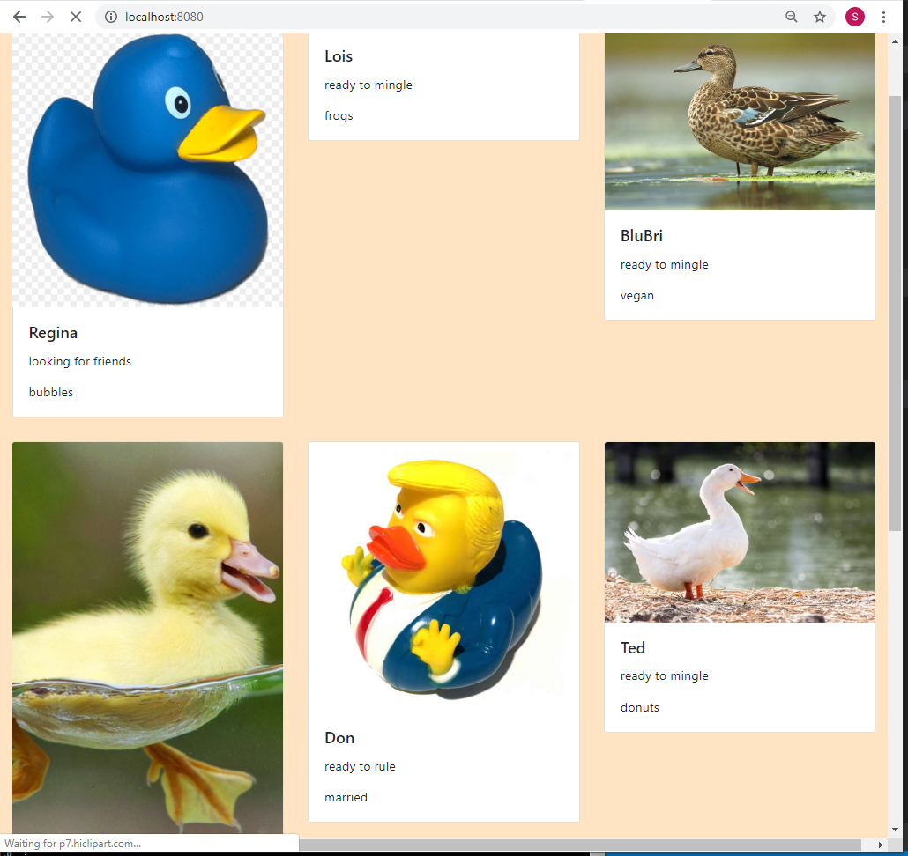

README.md
    #bootstrap
    
## Description
THis is a an exploration into the bootsrap grid system.  We used bootstrap cards to display. We also give our users the ability to filter the ducks by color, gender, and if the ducks are rubber. 

## Screenshots

## HOw to run 
1. Clone down this repo
2. Make sure you have http-server installed via npm. If not get it [HERE](https://www.npmjs.com/package/http-server).
1.. On your command line run `hs-p 9999` 
1. In your browser got to   `http://localhost:9999`

    